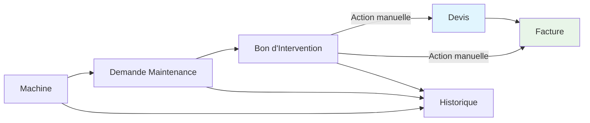

# Amat TP - Gestion d'Objets Métier

Module Odoo 16 pour la gestion des machines, bons d'intervention et suivi maintenance.

## 📋 Description

Ce module permet aux entreprises de gérer efficacement leur parc de machines, les interventions sur site et la maintenance. Il s'intègre parfaitement avec les modules natifs Odoo (Maintenance, Ventes, Facturation) pour un workflow complet.

### ✨ Fonctionnalités principales

- **🚛 Gestion du parc machines** : Inventaire complet avec photos, caractéristiques techniques, localisation
- **📋 Bons d'intervention** : Workflow complet de l'intervention à la facturation
- **🔧 Maintenance intégrée** : Planification et suivi des maintenances préventives/correctives
- **👥 Fiches clients enrichies** : CA annuel, alertes, historique
- **💰 Intégration commerciale** : Actions pour créer devis et factures depuis les bons d'intervention

## 🏗️ Architecture & Organisation

### Structure des menus

```
🏗️ GESTION OBJETS (menu dédié)
├── Machines
└── Clients

🔧 MAINTENANCE (intégration module Odoo)
├── Tableau de bord
├── Demandes de maintenance
├── 🚛 Machines ← Intégration
└── Équipements

💰 VENTES (intégration module Odoo)
├── Devis
├── Commandes
└── 📋 Bons d'Intervention ← Intégration

💳 FACTURATION (module Odoo séparé)
├── Factures clients
├── Factures fournisseurs
└── Paiements
```

### Workflow utilisateur



## 🚀 Installation

### Prérequis

- Odoo Community 16.0
- Modules dépendants : `base`, `mail`, `account`, `maintenance`, `sale`, `product`, `contacts`

## ⚙️ Configuration

### Configuration initiale

1. **Créer des catégories de machines**
   - Gestion Objets → Machines → Créer

2. **Configurer les équipes de maintenance**
   - Maintenance → Configuration → Équipes de maintenance

3. **Paramétrer les séquences** (optionnel)
   - Paramètres → Technique → Séquences
   - Modifier "Bon d'intervention" pour personnaliser la numérotation

### Données de démonstration

Le module n'inclut pas de données de démonstration pour éviter de polluer votre environnement de production.

## 📖 Utilisation

### Gestion des machines

#### Créer une machine
1. **Gestion Objets → Machines → Créer**
2. Remplir les informations :
   - Désignation (ex: "Pelle sur chenilles 320T")
   - Client propriétaire
   - Type de machine, marque, modèle
   - Numéro de série (obligatoire, unique)
   - Numéro de parc client (optionnel)

#### Informations techniques
- **Motorisation** : Marque, modèle, numéro de série moteur
- **Caractéristiques** : Année, poids, compteur horaire
- **Localisation** : Emplacement actuel, contact sur site
- **Documents** : Manuels, certificats, schémas

### Bons d'intervention

#### Créer un bon d'intervention
1. **Ventes → Bons d'Intervention → Créer**
2. Sélectionner :
   - Client
   - Machine concernée (optionnel)
   - Date d'intervention
   - Technicien responsable

#### Workflow complet
1. **Brouillon** → Saisie des informations
2. **Confirmé** → Intervention planifiée
3. **Terminé** → Signature client, détails intervention
4. **Facturé** → **Action manuelle** pour créer une facture

#### Actions disponibles
- **Créer un devis** : Bouton pour générer un devis depuis le bon d'intervention
- **Créer une facture** : Bouton pour facturer un bon d'intervention terminé
- **Voir les factures** : Accès direct aux factures liées

### Maintenance des machines

#### Demandes de maintenance
1. **Maintenance → Machines → Créer**
2. Sélectionner la machine concernée
3. Le client est automatiquement rempli
4. Planifier l'intervention

#### Types de maintenance
- **Préventive** : Maintenance planifiée selon planning
- **Corrective** : Intervention suite à panne

## 🏗️ Structure technique

### Modèles principaux

#### `am.asset` - Machines
```python
# Champs principaux
name = fields.Char(required=True)  # Désignation
partner_id = fields.Many2one('res.partner')  # Client propriétaire
type_machine = fields.Selection([...])  # Type de machine
numero_serie = fields.Char(required=True)  # Numéro série unique
```

#### `bon_intervention.bon_intervention` - Bons d'intervention
```python
# Champs principaux  
name = fields.Char()  # Référence auto-générée
partner_id = fields.Many2one('res.partner')  # Client
asset_id = fields.Many2one('am.asset')  # Machine concernée
state = fields.Selection([...])  # État du bon
```

### Intégrations

#### Extension `res.partner` (Clients)
- Compteur de machines
- CA annuel automatique
- Historique CA par année
- Champs d'alerte et mémo

#### Extension `maintenance.request`
- Lien vers machines (`asset_id`)
- Client automatique depuis la machine
- Interface dédiée dans le menu Maintenance

#### Extension `sale.order` (Devis)
- Lien vers bon d'intervention
- Gestion contrats de maintenance
- Fréquence de maintenance

### Sécurité

#### Groupes d'accès
- **Utilisateur** : Lecture seule sur machines et bons
- **Responsable** : Droits complets de gestion

#### Règles multi-société
- Filtrage automatique par société
- Respect de la structure multi-société Odoo

## 🔧 Personnalisation

### Ajouter des types de machines

Modifier le champ `type_machine` dans `models/asset.py` :
```python
type_machine = fields.Selection([
    ('pelle', 'Pelle'),
    ('chargeuse', 'Chargeuse'),
    # Ajouter vos types ici
    ('nouveau_type', 'Nouveau Type'),
], string="Type de machine")
```

### Personnaliser les séquences

Modifier `data/ir_sequence_data.xml` :
```xml
<field name="prefix">BI/%(year)s/</field>  <!-- Format : BI/2025/00001 -->
<field name="padding">5</field>           <!-- Nombre de zéros -->
```

### Ajouter des champs métier

Exemple d'ajout d'un champ dans les machines :
```python
# Dans models/asset.py
mon_champ = fields.Char(string="Mon champ personnalisé")
```

Puis l'ajouter dans la vue `views/asset_views.xml`.

## 📊 Performances

### Optimisations incluses
- Index sur les champs de recherche principaux
- Calculs mis en cache (CA client)
- Requêtes optimisées pour les vues liste

### Monitoring
- Tâche cron mensuelle pour le calcul du CA